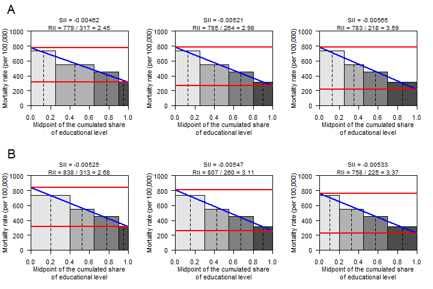

Relative and Slope Index of Inequality
================
bdevleesschauwer
Mon Apr 01 16:29:08 2019

``` r
### RII/SII plots

## RII/SII PLOT / 4 SE groups
rii_plot4 <-
function(r4, p4) {
  c <- c(0, cumsum(p4))
  x <- head(c, -1) + diff(c) / 2
  fit <- lm(r4 ~ x, weights = p4)
  prd <- predict(fit, data.frame(x = c(0,1)))
  rii <- formatC(prd[1]/prd[2], format = "f", digits = 2)
  sii <- formatC(coef(fit)[2]/1e5, format = "f", digits = 5)

  plot(c(0, 1), c(0, 1000), type = "n", xaxs = "i", yaxs = "i", las = 1,
       xlab = "Midpoint of the cumulated share\nof educational level",
       ylab = "Mortality rate (per 100,000)")

  polygon(c(c[1], c[2], c[2], c[1]),
          c(0, 0, r4[1], r4[1]),
          col = rgb(0, 0, 0, 0.1))
  polygon(c(c[2], c[3], c[3], c[2]),
          c(0, 0, r4[2], r4[2]),
          col = rgb(0, 0, 0, 0.3))
  polygon(c(c[3], c[4], c[4], c[3]),
          c(0, 0, r4[3], r4[3]),
          col = rgb(0, 0, 0, 0.5))
  polygon(c(c[4], c[5], c[5], c[4]),
          c(0, 0, r4[4], r4[4]),
          col = rgb(0, 0, 0, 0.7))

  lines(c(x[1], x[1]), c(0, r4[1]), lty = 2)
  lines(c(x[2], x[2]), c(0, r4[2]), lty = 2)
  lines(c(x[3], x[3]), c(0, r4[3]), lty = 2)
  lines(c(x[4], x[4]), c(0, r4[4]), lty = 2)

  abline(fit, col = "blue", lwd = 2)
  abline(h = prd, col = "red", lwd = 2)
  mtext(
    line = 0,
    cex = .6,
    sprintf("RII = %s / %s = %s", round(prd[1]), round(prd[2]), rii))
  mtext(
    line = 1,
    cex = .6,
    sprintf("SII = %s", sii))
}


## Figure 1 (3*2 plot)
```

``` r
par(mfrow = c(2, 3))

# define mortality rates
r4 <- c(733.8, 552.1, 450.1, 313.9)

# define proportions EL1:4
# .. EL1 and EL3 fixed
# .. EL2 and EL4 vary between 40% and 10%
p4 <-
cbind(
  c(0.25, 0.40, 0.25, 0.10),
  c(0.25, 0.30, 0.25, 0.20),
  c(0.25, 0.20, 0.25, 0.30),
  c(0.25, 0.10, 0.25, 0.40))
colSums(p4)
```

    ## [1] 1 1 1 1

``` r
rii_plot4(r4, p4[, 1])
text("A", x = -.2, y = 1300, cex = 2, xpd = NA)
rii_plot4(r4, p4[, 2])
rii_plot4(r4, p4[, 3])

# define proportions EL1:4
# .. EL2 and EL3 fixed
# .. EL1 and EL4 vary between 40% and 10%
p4 <-
cbind(
  c(0.40, 0.25, 0.25, 0.10),
  c(0.30, 0.25, 0.25, 0.20),
  c(0.20, 0.25, 0.25, 0.30),
  c(0.10, 0.25, 0.25, 0.40))
colSums(p4)
```

    ## [1] 1 1 1 1

``` r
rii_plot4(r4, p4[, 1])
text("B", x = -.2, y = 1300, cex = 2, xpd = NA)
rii_plot4(r4, p4[, 2])
rii_plot4(r4, p4[, 3])
```

<!-- -->

``` r
##rmarkdown::render("Fig1.R")
```
