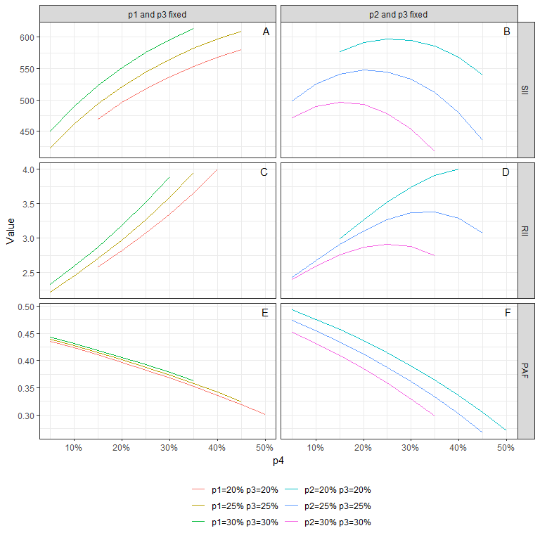

Relative and Slope Index of Inequality
================
Bdevleesschauwer
Mon Apr 08 23:38:12 2019

# Settings

``` r
## required packages
library(bd)
library(ggplot2)

## helper functions
pct <- function(x, ...) scales::percent(x, accuracy = 1,...)

## import data
dta <- readxl("Fig2.xlsx")
str(dta)
```

    ## 'data.frame':    139 obs. of  7 variables:
    ##  $ p1       : num  0.2 0.2 0.2 0.2 0.2 0.2 0.2 0.25 0.25 0.25 ...
    ##  $ p2       : num  0.45 0.4 0.35 0.3 0.25 0.2 0.15 0.45 0.4 0.35 ...
    ##  $ p3       : num  0.2 0.2 0.2 0.2 0.2 0.2 0.2 0.25 0.25 0.25 ...
    ##  $ p4       : num  0.15 0.2 0.25 0.3 0.35 0.4 0.45 0.05 0.1 0.15 ...
    ##  $ Value    : num  -470 -496 -518 -537 -553 ...
    ##  $ Indicator: chr  "SII" "SII" "SII" "SII" ...
    ##  $ Set      : chr  "P1P3" "P1P3" "P1P3" "P1P3" ...

``` r
## clean data
dta$g[dta$Set == "P1P3"] <-
  with(dta[dta$Set == "P1P3", ], paste0("p1=", pct(p1), " p3=", pct(p3)))
dta$g[dta$Set == "P2P3"] <-
  with(dta[dta$Set == "P2P3", ], paste0("p2=", pct(p2), " p3=", pct(p3)))

dta$Value[dta$Indicator == "SII"] <- abs(dta$Value[dta$Indicator == "SII"])

dta$Indicator <- factor(dta$Indicator, c("SII", "RII", "PAF"))
dta$Set <- factor(dta$Set, labels = c("p1 and p3 fixed", "p2 and p3 fixed"))

# panel labels
dta_text <-
  data.frame(Set = rep(levels(dta$Set), 3),
             Indicator = rep(levels(dta$Ind), each = 2),
             Label = LETTERS[1:6])
```

# Figure 2

``` r
ggplot(dta, aes(x = p4, y = Value)) +
  geom_line(aes(col = factor(g))) +
  facet_grid(Indicator~Set, scales = "free_y") +
  theme_bw() +
  scale_x_continuous("p4", labels = pct) +
  scale_color_discrete(NULL) +
  geom_text(data = dta_text,
            mapping = aes(x = Inf, y = Inf, label = Label),
            hjust = 2,
            vjust = 1.5) +
  guides(color = guide_legend(nrow = 3, byrow = FALSE)) +
  theme(legend.position = "bottom")
```

<!-- -->

``` r
##rmarkdown::render("Fig2.R")
```
